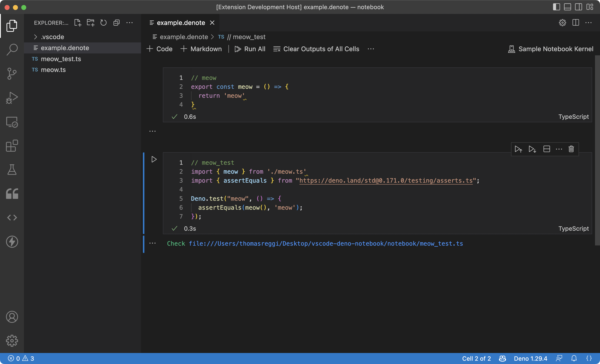

# vscode deno notebook (denote)

> This is a proof of concept

To test the extension do the following:

1. Run npm install
2. Go to "debug" and "Run Extension" in VSCode
3. Wait for the local vscode window to popup (this has the extension running) 
3. Navigate to the `notebook` folder
4. Open the `example.denote` file

